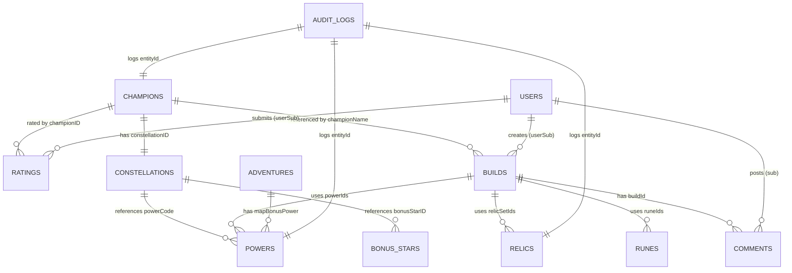
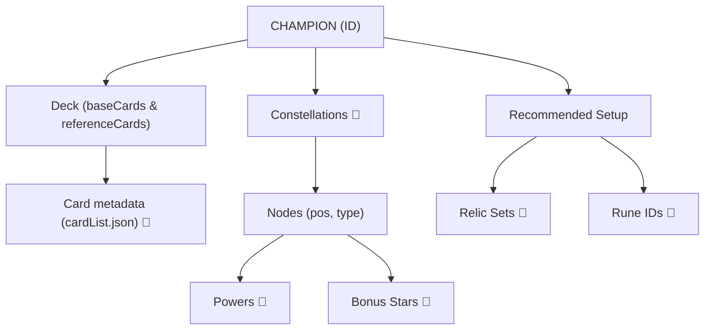
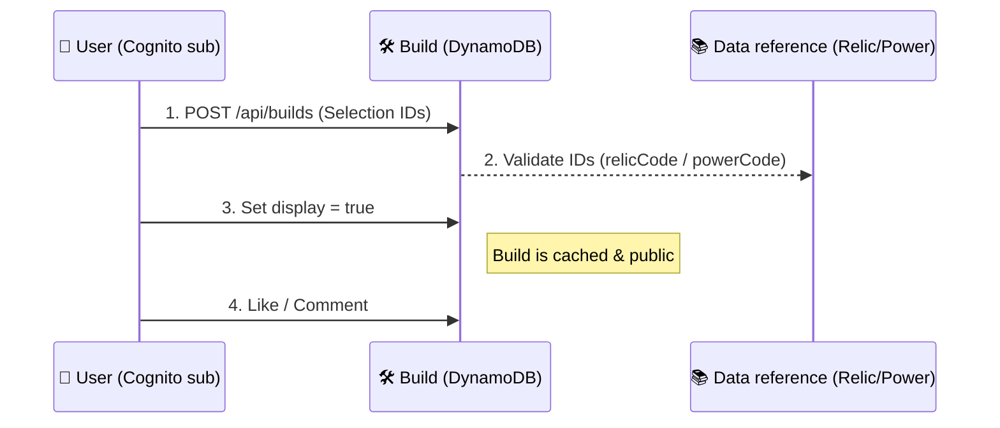

# Project Database Schemas & Data Structures

This document serves as the Single Source of Truth (SSOT) for all data entities in the "The Path of Champion Guide" project. It covers DynamoDB tables, local JSON files, and their relationships.

---

## Data Architecture Diagram

---

## Data Topology & Lifecycle

### Champion Graph

Shows how a Champion entity aggregates diverse game data.

### User Action Lifecycle

How a user's action generates interconnected data.

---

## Visual Syntax Reference

| Icon | Meaning                                      |
| :--- | :------------------------------------------- |
| 🔑   | **Partition Key** (DynamoDB) / Unique ID     |
| ↕️   | **Sort Key** (DynamoDB)                      |
| 🔗   | **Foreign Key** / Reference to another table |
| ⚡   | **GSI** (Global Secondary Index)             |
| 📂   | **Local Data** (JSON file)                   |

---

## 1. Core Game Entities

### 1.1 Champions (`guidePocChampionList`)

Main table for champion data, including stats, traits, and deck references.

| Field               | Type                 | PK/SK | Description                                                                             |
| :------------------ | :------------------- | :---- | :-------------------------------------------------------------------------------------- |
| `championID`        | String               | 🔑    | Unique identifier (e.g., `lux`, `yasuo`).                                               |
| `name`              | String               |       | Display name in Vietnamese.                                                             |
| `isNew`             | Boolean              |       | (Optional) Flag for newly added champions.                                              |
| `maxStar`           | Number               |       | Maximum star level (default: 7).                                                        |
| `regions`           | Array<String>        |       | Regions the champion belongs to (e.g., `["Demacia"]`).                                  |
| `cost`              | Number               |       | In-game mana cost.                                                                      |
| `tags`              | Array<String>        |       | Custom tags for filtering (e.g., `["Aggro", "Combo"]`).                                 |
| `assets`            | Array<Object>        |       | List of asset objects `{avatar, portrait, ...}`.                                        |
| `translations`      | Object               |       | Multilingual data `{en: {name, ...}, vi: {name, ...}}`.                                 |
| `ratings`           | Object               |       | Admin's 10-point scale ratings `{damage, defense, ...}`.                                |
| `startingDeck`      | Object               |       | Contains `baseCards` and `referenceCards` (each with `cardCode`, `count`, `itemCodes`). |
| `adventurePowerIds` | Array<String>        | 🔗    | Relates to `guidePocPowers`.                                                            |
| `powerStarIds`      | Array<String>        | 🔗    | Relates to `guidePocPowers` (Star Powers).                                              |
| `relicSets`         | Array<Array<String>> | 🔗    | Recommended relic combinations (Relates to `guidePocRelics`).                           |
| `runeIds`           | Array<String>        | 🔗    | Relates to `guidePocRunes`.                                                             |

### 1.2 Items (`guidePocItems`)

Items that can be attached to cards.

| Field                   | Type   | PK/SK | Description                                  |
| :---------------------- | :----- | :---- | :------------------------------------------- |
| `itemCode`              | String | 🔑    | Unique item code (e.g., `I0070`).            |
| `name`                  | String |       | Item name.                                   |
| `description`           | String |       | Description with markup (e.g., `<link=...`). |
| `descriptionRaw`        | String |       | Plain text description.                      |
| `rarity`                | String |       | Rarity string (e.g., `COMMON`, `EPIC`).      |
| `rarityRef`             | String |       | Reference to rarity level (e.g., `Rare`).    |
| `assetAbsolutePath`     | String |       | URL to the item icon.                        |
| `assetFullAbsolutePath` | String |       | URL to full-size item image.                 |

### 1.3 Powers (`guidePocPowers`)

Passive or active powers available in adventures.

| Field          | Type          | PK/SK | Description              |
| :------------- | :------------ | :---- | :----------------------- |
| `powerCode`    | String        | 🔑    | Unique power code.       |
| `name`         | String        |       | Power name.              |
| `description`  | String        |       | description with markup. |
| `rarity`       | String        |       | Rarity level.            |
| `type`         | Array<String> |       | Power categories.        |
| `translations` | Object        |       | Multilingual data.       |

### 1.4 Relics (`guidePocRelics`)

Equippable artifacts for champions.

| Field          | Type   | PK/SK | Description                    |
| :------------- | :----- | :---- | :----------------------------- |
| `relicCode`    | String | 🔑    | Unique relic code.             |
| `name`         | String |       | Relic name.                    |
| `description`  | String |       | Description with markup.       |
| `rarity`       | String |       | Rarity level.                  |
| `type`         | String |       | Type (e.g., `COMMON`, `RARE`). |
| `stack`        | Number |       | (Optional) Max stack limit.    |
| `translations` | Object |       | Multilingual data.             |

### 1.5 Runes (`guidePocRunes`)

Runes that provide passive bonuses.

| Field          | Type   | PK/SK | Description              |
| :------------- | :----- | :---- | :----------------------- |
| `runeCode`     | String | 🔑    | Unique rune code.        |
| `name`         | String |       | Rune name.               |
| `description`  | String |       | Description with markup. |
| `rarity`       | String |       | Rarity level.            |
| `translations` | Object |       | Multilingual data.       |

---

## 2. Progression & World Building

### 2.1 Constellations (`guidePocChampionConstellation`)

Champion star-tree/constellation data.

| Field             | Type          | PK/SK | Description                                              |
| :---------------- | :------------ | :---- | :------------------------------------------------------- |
| `constellationID` | String        | 🔑    | Matches `championID`.                                    |
| `championName`    | String        | 🔗    | Champion's name for clarity.                             |
| `nodes`           | Array<Object> |       | List of star nodes `{pos, powerCode, bonusStarID, ...}`. |

### 2.2 Bonus Stars (`guidePocBonusStar`)

Special nodes within a constellation (e.g., +Mana, +HP).

| Field          | Type   | PK/SK | Description                         |
| :------------- | :----- | :---- | :---------------------------------- |
| `bonusStarID`  | String | 🔑    | Unique ID for the bonus star trait. |
| `name`         | String |       | Trait name.                         |
| `translations` | Object |       | Multilingual data.                  |

### 2.3 Bosses (`guidePocBosses`)

Boss entities encountered in adventure maps.

| Field          | Type   | PK/SK | Description                     |
| :------------- | :----- | :---- | :------------------------------ |
| `bossID`       | String | 🔑    | Unique identifier for the boss. |
| `bossName`     | String |       | Boss display name.              |
| `translations` | Object |       | Multilingual data.              |

### 2.4 Adventure Maps (`guidePocAdventureMap`)

Maps and story adventures.

| Field           | Type          | PK/SK | Description                           |
| :-------------- | :------------ | :---- | :------------------------------------ |
| `adventureID`   | String        | 🔑    | Unique ID for the adventure.          |
| `adventureName` | String        |       | Adventure name.                       |
| `difficulty`    | Number        |       | Difficulty level (e.g., 0.5, 1, 4.5). |
| `mapBonusPower` | Array<Object> | 🔗    | Special powers specific to the map.   |
| `translations`  | Object        |       | Multilingual data.                    |

---

## 3. Community & Build Sharing

### 3.1 Builds (`Builds`)

User-created champion builds.

| Field          | Type           | PK/SK | Description                            |
| :------------- | :------------- | :---- | :------------------------------------- |
| `id`           | String         | 🔑    | Unique UUID.                           |
| `creator`      | String         | ⚡    | Username of the creator.               |
| `championName` | String         | 🔗    | Name of the champion the build is for. |
| `description`  | String         |       | Strategy notes for the build.          |
| `relicSetIds`  | Array<String>  | 🔗    | Chosen relic codes.                    |
| `powerIds`     | Array<String>  | 🔗    | Chosen power codes.                    |
| `star`         | Number         |       | Target champion star level (0-6).      |
| `display`      | String/Boolean |       | Set to `"true"` to be public.          |
| `like`         | Number         |       | Count of user likes.                   |
| `views`        | Number         |       | Count of build views.                  |
| `createdAt`    | String         |       | ISO timestamp.                         |

### 3.2 Ratings (`guidePocPlayStyleRating`)

Community-sourced champion ratings.

| Field        | Type   | PK/SK | Description                                   |
| :----------- | :----- | :---- | :-------------------------------------------- |
| `championID` | String | 🔑    | ID of the champion being rated.               |
| `userSub`    | String | ↕️ 🔗 | AWS Cognito `sub` of the user.                |
| `username`   | String |       | Username of the rater.                        |
| `ratings`    | Object |       | Scores 1-10 `{damage, defense, speed, ...}`.  |
| `comment`    | String |       | Text review.                                  |
| `reviewType` | String | ⚡    | Fixed value `"CHAMPION_REVIEW"` for indexing. |
| `createdAt`  | String |       | ISO timestamp.                                |

### 3.3 Guides (`guidePocGuideList`)

Articles and strategy guides.

| Field           | Type   | PK/SK | Description                        |
| :-------------- | :----- | :---- | :--------------------------------- |
| `slug`          | String | 🔑    | URL slug and unique ID.            |
| `title`         | String |       | Guide title.                       |
| `description`   | String |       | Short summary.                     |
| `content`       | String |       | Main article body (Markdown/HTML). |
| `views`         | Number |       | View count.                        |
| `publishedDate` | String |       | Date published (`dd-mm-yyyy`).     |
| `updateDate`    | String |       | Last updated date (`dd-mm-yyyy`).  |

### 3.4 Comments (`Comments`)

User comments on builds or guides.

| Field             | Type   | PK/SK | Description                                  |
| :---------------- | :----- | :---- | :------------------------------------------- |
| `id`              | String | 🔑    | Unique UUID.                                 |
| `buildId`         | String | ⚡ 🔗 | ID of the target build or `"global"`.        |
| `content`         | String |       | Comment text.                                |
| `sub`             | String | 🔗    | AWS Cognito `sub` of the author.             |
| `username`        | String |       | Username of the author.                      |
| `parentId`        | String | 🔗    | (Optional) Parent comment ID for replies.    |
| `replyToUsername` | String |       | (Optional) Username of parent author.        |
| `championName`    | String |       | (De-normalized) Name of associated champion. |
| `type`            | String | ⚡    | Fixed value `"comment"`.                     |
| `createdAt`       | String |       | ISO timestamp.                               |

---

## 4. System Support

### 4.1 Audit Logs (`guidePocAuditLogs`)

Admin action history.

| Field        | Type        | PK/SK | Description                                      |
| :----------- | :---------- | :---- | :----------------------------------------------- |
| `logId`      | String      | 🔑    | Unique UUID.                                     |
| `action`     | String      | ⚡    | Action performed (`CREATE`, `UPDATE`, `DELETE`). |
| `entityType` | String      | ⚡    | Entity affected (`champion`, `power`, etc.).     |
| `entityId`   | String      | 🔗    | PK of the affected entity.                       |
| `oldData`    | JSON String |       | Data state before the change.                    |
| `newData`    | JSON String |       | Data state after the change.                     |
| `timestamp`  | String      | ↕️ ⚡ | ISO timestamp.                                   |
| `logType`    | String      | ⚡    | Fixed value `"LOG"` for indexing.                |

### 4.2 Users & Authentication (AWS Cognito)

User profiles and permissions managed via AWS Cognito User Pool.

| Field        | Type   | Description                           |
| :----------- | :----- | :------------------------------------ |
| `sub`        | String | Unique Subject ID (Primary User ID).  |
| `email`      | String | User's registered email address.      |
| `username`   | String | Login username.                       |
| `name`       | String | Display name.                         |
| `adminGroup` | String | Determines administrative privileges. |

### 4.3 Local Game Data (`cardList.json`)

Static metadata for all specialized cards, items, and keywords from Riot Data Dragon.

| Field                | Type   | Description                               |
| :------------------- | :----- | :---------------------------------------- |
| `cardCode`           | String | Unique card identifier (e.g., `01IO012`). |
| `name`               | String | Localization key / Display name.          |
| `regions`            | Array  | Faction association.                      |
| `cost`               | Number | Mana value.                               |
| `type`               | String | Card category (Unit, Spell, Landmark).    |
| `associatedCardRefs` | Array  | List of related card codes.               |

---

## 5. Relationships Overview

- **Champions** are the central entity.
- `championID` links to **Ratings**, **Constellations**, and **Builds**.
- `relicCode`, `powerCode`, `itemCode`, `runeCode` are used in **Champions**, **Constellations**, and **Builds** for referencing data.
- **Audit Logs** track changes across all entities using `entityId` and `entityType`.
- **Comments** link to specific **Builds** via `buildId`.
